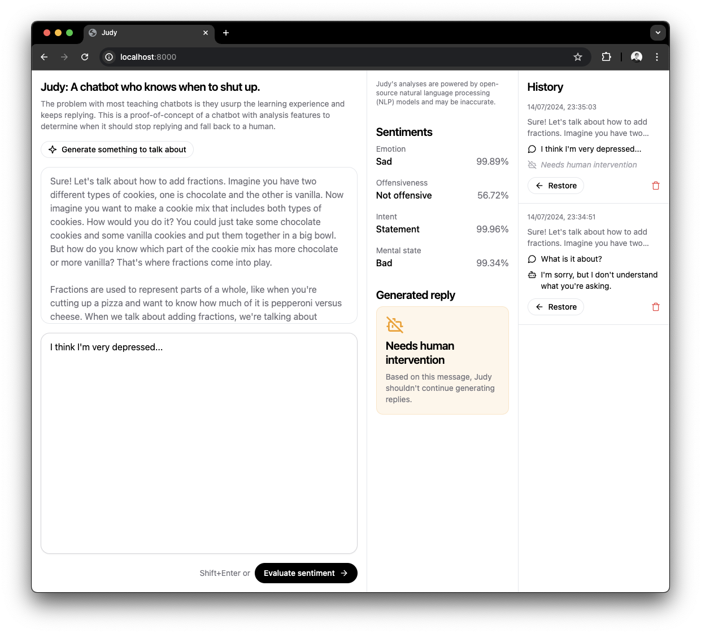

# Judy: A chatbot who knows when to shut up.

> Submitted by team **Cikgang** for the Entry Coding Challenge of the Huawei Tech4City 2024 Competition Semi-finals.

The problem with most teaching chatbots is they usurp the learning experience and keeps replying. This is a proof-of-concept of a chatbot with analysis features to determine when it should stop replying and fall back to a human.

Our project, Cikgo, will eventually develop a feature called Autoreply, which automatically generates replies to messages sent by students. To be useful, Autoreply's engine must be able to determine _when to stop replying and fall back to a human_. For example,

1. if a student repeatedly returns with more questions, i.e., the AI-generated replies aren't helping,
2. if a student's message indicates a bad mental state, e.g., depression (not necessarily clinical), suicidal indications, etc.,
3. if a student digresses from the topic of the conversation, e.g., personal issues, other unrelated topics, etc., or
4. anything else that isn't ethically or productively answerable by AI, or is best answered by human teachers.

> [!NOTE]
> For this proof-of-concept, we use open-source NLP models that run locally. Analysis results may not be accurate. However, analyses' quality can be improved with better models and/or heuristics. In this project, this aspect is left as an abstraction. We selected the best NLP models we could find and focused on building a minimum viable product.

# Usage Instructions

First, build the docker image `judy`, then run the container. You will need to map two local volumes to the container: `hub` and `data`. The `hub` volume is used to store the models and the `data` volume is used to store the chat history. This way, the chat history is persisted even if the container is stopped. Port `8080` is exposed for the web interface.

```sh
docker build -t judy .
docker run -it --rm -v ./hub:/app/hub -v ./data:/app/data -p 8080:8080 judy
```

App will be available at `http://localhost:8080`.

# Interface

The interface is split into 3 left-to-right sections: Chat Interface, Analysis Results, and History.  


1. **Chat Interface**: Provides a simple chat interface for users to interact with the chatbot.  
   Users are able to directly start typing a message, or choose to generate a conversational starter first.  
    

2. **Analysis Results**: Displays the results of the AI/ML models used to analyze the conversation.  
   This section also flags out if the chatbot is unable to provide appropriate responses, and human intervention is required.  
     

3. **History**: Shows the historical messages and analyses of the conversation.  
   You can restore any previous message or delete the message permanently here.  
    

# Application Architecture

1. **Frontend**: The frontend is built using vanilla HTML, CSS, and JavaScript, files in `frontend/`.
2. **Backend**: The API backend is built using Flask, a Python web framework, with endpoints specified in `backend/app.py`.
3. **Database**: The database uses SQLite to store the the historical messages and analyses, and the sqlalchemy python library as the Object Relational Mapper (ORM) in `backend/database.py`.
4. **AI/ML Models**: The application uses specially curated pre-trained models selected from the Hugging Face Transformers library for Natural Language Understanding and Generation, Emotion Detection, Offensive Content Filtering, Question Detection, and Mental State Classification.

# AI/ML Features

1. **Natural Language Understanding and Generation**: Utilizes the Qwen2-1.5B-Instruct-GGUF model to generate conversational starters as well as contextually relevant replies. We chose this model to balance performance and resource consumption (no GPU environment).
2. **Emotion Detection**: Employs the DistilBERT model fine-tuned for emotion detection to understand the emotional context of the conversation.
3. **Offensive Content Filtering**: Uses the RoBERTa model fine-tuned for offensive content detection to ensure the conversation remains appropriate.
4. **Question Detection**: Integrates a BERT-mini model fine-tuned for question detection to distinguish if the user is asking a question or making a statement.
5. **Mental State Classification**: Leverages the BART model for zero-shot classification to understand the mental state of the user.
